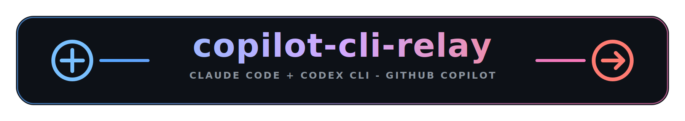

<h1 align="center">
  
</h1>

<p align="center">
  <a href="https://www.anthropic.com/claude"> Claude Code</a>
  &nbsp;·&nbsp;
  <a href="https://github.com/features/copilot"> GitHub Copilot</a>
  &nbsp;·&nbsp;
  <a href="https://github.com/openai/codex"><picture><source media="(prefers-color-scheme: dark)" srcset="assets/openai-logo-dark.svg"><source media="(prefers-color-scheme: light)" srcset="assets/openai-logo-light.svg"></picture> OpenAI Codex CLI</a>
</p>

<p align="center">
  <em>A small Python reverse proxy that lets <strong>Claude Code</strong> and <strong>Codex CLI</strong> talk to <strong>GitHub Copilot</strong> - swap the auth header, keep the native protocols. No separate Anthropic or OpenAI API key needed.</em>
</p>

<p align="center">
  
  
  
  
  
</p>

<p align="center">
  <a href="https://www.anthropic.com/claude"></a>
  
  <a href="https://github.com/features/copilot"></a>
  
  <a href="https://github.com/openai/codex"></a>
</p>

---

> ## ⚠️ Disclaimer
>
> **Unofficial, unsupported, proof-of-concept.** This project is an independent experiment and is **not affiliated with, endorsed by, or supported by Microsoft, GitHub, or Anthropic**. None of those organizations have reviewed, blessed, or sanctioned it.
>
> It is **not a product**. There is no warranty, no SLA, no support, and no guarantee of fitness for any purpose. APIs, headers, model availability, and tenant behavior on the upstream services can change at any time and break this proxy without notice.
>
> **Use at your own risk.** You are solely responsible for ensuring that your use of GitHub Copilot through this proxy complies with your Copilot subscription terms, your employer's acceptable-use policies, and any applicable laws. The authors and contributors accept **no liability** for account suspension, data loss, billing surprises, security incidents, or any other damages arising from use of this software. See [`LICENSE`](LICENSE) for the full no-warranty / no-liability terms.

---

A small Python reverse proxy that runs in Docker. It accepts Anthropic Messages API requests from Claude Code under `/claude/v1` and forwards them to Copilot's native `/v1/messages` endpoint. It accepts OpenAI Responses API requests from Codex CLI under `/codex/v1` and forwards them to Copilot's native `/responses` endpoint. **No protocol translation** - Copilot speaks both protocols natively for the model families this proxy exposes.

## How it works

```text
+==============================+       +========================================+       +================================+
| Claude Code                  |       | copilot-cli-relay                      |       | GitHub Copilot                 |
| Anthropic Messages JSON/SSE  |       | 127.0.0.1:4141                         |       | Anthropic native endpoints     |
| POST /claude/v1/messages     | ====> | Claude route handlers                  | ====> | POST /v1/messages              |
| GET  /claude/v1/models       | <==== | build_claude_outbound_headers          | <==== | GET  /models                   |
+==============================+       |                                        |       +================================+
                                       | uvicorn + Starlette                    |
                                       | shared httpx AsyncClient, HTTP/2       |
                                       | proxy_shared streaming + passthrough   |
+==============================+       |                                        |       +================================+
| Codex CLI                    |       | Codex route handlers                   |       | GitHub Copilot                 |
| OpenAI Responses JSON/SSE    |       | build_codex_outbound_headers           |       | Responses native endpoints     |
| POST /codex/v1/responses     | ====> | compact fallback, body cleanup         | ====> | POST /responses                |
| POST /codex/v1/responses/    | ====> |                                        | ====> | POST /responses/compact        |
| compact                      |       |                                        |       | or fallback to /responses      |
| GET  /codex/v1/models        | <==== |                                        | <==== | GET  /models                   |
+==============================+       +====================^===================+       +================================+
                                                            |
                                                            |
                                      .env: COPILOT_GITHUB_TOKEN
                                      extracted from Windows Credential Manager
```

| Client | Local relay routes | Upstream Copilot routes | Protocol |
|---|---|---|---|
| Claude Code | `POST /claude/v1/messages`<br>`GET /claude/v1/models` | `POST /v1/messages`<br>`GET /models` | Anthropic Messages JSON/SSE |
| Codex CLI | `POST /codex/v1/responses`<br>`POST /codex/v1/responses/compact`<br>`GET /codex/v1/models` | `POST /responses`<br>tries `POST /responses/compact`, then falls back to `POST /responses`<br>`GET /models` | OpenAI Responses JSON/SSE |

| Relay step | What happens |
|---|---|
| Auth | Reads `COPILOT_GITHUB_TOKEN` from `.env`, originally extracted from Windows Credential Manager. |
| Header safety | Strips local client auth, cookies, host, content length, and hop-by-hop headers. |
| Protocol headers | Adds the Copilot bearer plus Claude-specific or Codex-specific headers. |
| Compatibility | Applies small route-specific body rewrites, then streams the native upstream response format back unchanged. |

The proxy keeps each client on its native protocol. Claude Code sends Anthropic Messages traffic to `/claude/v1/messages`; Codex CLI sends OpenAI Responses traffic to `/codex/v1/responses`. The proxy swaps local dummy auth for the GitHub OAuth bearer Copilot expects, adds the Copilot headers each route needs, and leaves response streaming in the original SSE format.

Four things make this work cleanly:

1. The `copilot` CLI's OAuth token (in Windows Credential Manager) authenticates directly against `api.githubcopilot.com` — **no session-token exchange needed**.
2. Copilot exposes a native Anthropic Messages endpoint at `/v1/messages` that returns proper Anthropic SSE — **no API translation needed**.
3. Copilot exposes a native OpenAI Responses endpoint at `/responses` for GPT/Codex models — **no Chat Completions translation needed**.
4. Setting `Copilot-Integration-Id: copilot-developer-cli` is what unlocks Claude and GPT-5 Responses models on this Copilot tenant (`vscode-chat` rejected `gpt-5.5` during live testing).

## Claude Setup

Requires: Docker Desktop, PowerShell 7+ (`pwsh`), and a working `copilot` CLI login (`copilot` then sign in).

```powershell
# 1. Extract your Copilot OAuth token from Credential Manager to .env
pwsh scripts\extract-token.ps1

# 2. Start the proxy
docker compose up --build

# 3. In another terminal: verify Claude routes
curl http://127.0.0.1:4141/claude/healthz
curl http://127.0.0.1:4141/claude/v1/models
```

Then point Claude Code at the proxy:

```powershell
# Print the Claude Code settings snippet
pwsh scripts\claude-config.ps1

# Optional: update ~/.claude/settings.json and Windows user env after typing YES
pwsh scripts\claude-config.ps1 -Write
```

The helper writes the same settings as this manual `~/.claude/settings.json` example:

```json
{
  "env": {
    "ANTHROPIC_BASE_URL": "http://127.0.0.1:4141/claude",
    "ANTHROPIC_AUTH_TOKEN": "sk-dummy",
    "ANTHROPIC_MODEL": "claude-opus-4-7",
    "ANTHROPIC_SMALL_FAST_MODEL": "claude-sonnet-4-6"
  },
  "model": "claude-opus-4-7",
  "effortLevel": "medium"
}
```

Then restart Claude Code and run `claude` as usual. If Claude Code logs show `POST /v1/messages` instead of `POST /claude/v1/messages`, the base URL is missing the `/claude` suffix; rerun `pwsh scripts\claude-config.ps1 -Write`.

## Codex Setup

Requires: Docker Desktop, PowerShell 7+ (`pwsh`), a working `copilot` CLI login, and Codex CLI.

```powershell
# 1. Extract your Copilot OAuth token from Credential Manager to .env
pwsh scripts\extract-token.ps1

# 2. Start the proxy if it is not already running
docker compose up --build

# 3. In another terminal: verify Codex routes
curl http://127.0.0.1:4141/codex/healthz
curl http://127.0.0.1:4141/codex/v1/models
```

Codex uses its own path prefix so Claude Code's `/claude/v1/models` response stays Anthropic-shaped while Codex gets OpenAI Responses-compatible routes:

```powershell
# Print the Codex config snippet
pwsh scripts\codex-config.ps1

# Optional: write ~/.codex/config.toml + ~/.codex/copilot.config.toml and persist the dummy key after typing YES
pwsh scripts\codex-config.ps1 -Write
```

The helper configures two files. The provider lives in `~/.codex/config.toml`:

```toml
[model_providers.copilot]
name = "GitHub Copilot via local relay"
base_url = "http://127.0.0.1:4141/codex/v1"
wire_api = "responses"
env_key = "CODEX_PROXY_API_KEY"
requires_openai_auth = false
request_max_retries = 4
stream_max_retries = 10
stream_idle_timeout_ms = 300000
```

The profile lives in its own `~/.codex/copilot.config.toml` (top-level keys, **not** a `[profiles.copilot]` table). Codex 0.134+ overlays this file when you pass `--profile copilot` and no longer reads a legacy `[profiles.copilot]` table or a `profile = "copilot"` selector from `config.toml`; `-Write` removes any such legacy tables for you:

```toml
# ~/.codex/copilot.config.toml
model_provider = "copilot"
model = "gpt-5.5"
model_reasoning_effort = "medium"
```

Then start Codex with the relay profile. The proxy strips the dummy client auth and injects your Copilot OAuth bearer upstream:

```powershell
codex -p copilot
```

The `-Write` helper stores `CODEX_PROXY_API_KEY=dummy` as a Windows user environment variable and adds it to your PowerShell profile. Already-open terminals do not inherit new user env vars, so either open a new terminal or run this once before launching Codex:

```powershell
$env:CODEX_PROXY_API_KEY = "dummy"
codex -p copilot
```

Codex 0.130 sends `Authorization` only when the provider uses `env_key`; a literal `api_key = "dummy"` in `config.toml` did not send auth during testing. The proxy strips Codex's unsupported `image_generation` tool and `previous_response_id` before forwarding. `web_search` is preserved because this tenant's Copilot `/responses` endpoint accepts it.

Useful Codex checks:

```powershell
# Confirm Codex can read the proxy model catalog
codex debug models -c model_provider='"copilot"' -c model='"gpt-5.5"'

# Minimal end-to-end request through the proxy
codex exec --skip-git-repo-check --ephemeral --sandbox read-only -p copilot "Reply with exactly ok."
```

`/codex/v1/models` returns both OpenAI's model-list shape (`object`, `data`) and Codex's model catalog shape (`models`) because current Codex CLI tooling uses the richer catalog for discovery.

## Lifecycle helper

Interactive menu wrapping the common `docker compose` flows. Run it with no
arguments and pick a numbered action:

```powershell
pwsh scripts\proxy.ps1
```

```
copilot-cli-relay - pick an action:
  1) start     Start container (build only if image missing)
  2) stop      Stop and remove container + network
  3) restart   Restart to pick up src/ edits (starts if down)
  4) status    Show container status + port bind
  5) rebuild   Rebuild image and recreate container
  6) claude    Check Claude routes: /claude/healthz + /claude/v1/models
  7) codex     Check Codex routes: /codex/healthz + /codex/v1/models
  8) quit      Exit without doing anything
```

For scripted use, prefer the underlying `docker compose` commands directly.

## Claude Model Selection

Claude Code resolves the active model from three places, in this order of precedence:

1. **Top-level `"model"` in `settings.json`** — what the UI shows as your default and what `/model` switches between in-session.
2. **`ANTHROPIC_MODEL` env var** — the fallback used when no top-level `"model"` is set.
3. **`ANTHROPIC_SMALL_FAST_MODEL` env var** — used for cheap/quick background calls (title generation, tool-name guesses, etc.). Point this at a Haiku- or Sonnet-tier model so background traffic doesn't burn Opus quota.

For consistency, set both the top-level `"model"` and `ANTHROPIC_MODEL` to the same id so a stale env var can't silently override your settings.

A few things to know about the IDs:

- **Use the dash form** (`claude-opus-4-7`, not `claude-opus-4.7`). The proxy canonicalizes `/claude/v1/models` output to dash form because that's the shape Claude Code recognizes as a known Anthropic model — using it unlocks the right request shape (adaptive thinking, etc.). Both forms work upstream, but dash is what you want here.
- **`effortLevel`** is Claude Code's reasoning-effort knob. Valid values are `low`, `medium`, `high`. The proxy clamps each request to the values the target model actually accepts, read live from Copilot's `/models` capabilities (cached, ~5 min) and falling back to a small built-in table only if `/models` is unreachable. Currently Opus 4.8 and Opus 4.7 accept only `medium`, and Haiku 4.5 / Opus 4.5 / Sonnet 4.5 don't support reasoning effort at all (the field is stripped). If you set `high` for an Opus 4.8 / 4.7 default, the proxy quietly downgrades it to `medium` rather than letting the request 400 — and because the allowed set is read from upstream, new models are handled automatically without a proxy update. Copilot's endpoint also moved this knob: it now wants `output_config.effort` (not a top-level `reasoning_effort`) and `thinking.type: "adaptive"` (not `"enabled"` with a `budget_tokens`). The proxy rewrites both legacy shapes for you, so Claude Code's older request bodies keep working.
- **1M context:** Copilot exposes 1M-context variants for Opus 4.6 and 4.7 only — `/claude/v1/models` advertises them as `claude-opus-4-6-1m` and `claude-opus-4-7-1m-internal` (dash form, what Claude Code's `/model` validation accepts). The proxy converts these ids to the dot form (`claude-opus-4.6-1m` / `claude-opus-4.7-1m-internal`) only at the last hop before forwarding upstream — Copilot returns `model_not_supported` for the dash form on these specific ids, while accepting both forms for every other model. When Claude Code's hardcoded "Opus 4.7 (1M context)" picker tier sends the standard `claude-opus-4-7` id plus the `context-1m-2025-08-07` beta header, the proxy auto-rewrites the model id to the 1M variant so you actually get 1M context (Copilot rejects the beta header itself; the `-1m` model id is the real switch). To pin a 1M variant as your session default, set `"model": "claude-opus-4-7-1m-internal"` in `settings.json`. Sonnet has no 1M variant on this tenant — picker tier "Sonnet (1M context)" silently downgrades to 200K because there's nothing to remap to.
- **Switching mid-session:** `/model claude-sonnet-4-6` inside Claude Code changes the model for the current conversation without editing `settings.json`.

Optional env vars to consider adding to the `"env"` block:

- `"DISABLE_NON_ESSENTIAL_MODEL_CALLS": "1"` — skip the small/fast background calls entirely if you don't want any haiku traffic.
- `"CLAUDE_CODE_ATTRIBUTION_HEADER": "0"` — drop the `X-Claude-Code-…` attribution header from outbound requests.

## Configuration (env vars)

<table>
  <thead>
    <tr>
      <th width="310">Environment variable</th>
      <th>Default</th>
      <th>Purpose</th>
    </tr>
  </thead>
  <tbody>
    <tr>
      <td width="310"><code>COPILOT_GITHUB_TOKEN</code></td>
      <td>-</td>
      <td><strong>Required.</strong> Set by <code>extract-token.ps1</code>.</td>
    </tr>
    <tr>
      <td width="310"><code>COPILOT_PROXY_PORT</code></td>
      <td><code>4141</code></td>
      <td>Read only by the <code>python -m copilot_cli_relay</code> entrypoint. The Docker <code>CMD</code> hardcodes <code>--port 4141</code>, so changing this in <code>.env</code> has no effect when running via <code>docker compose</code>. Change the published port in <code>docker-compose.yml</code> instead.</td>
    </tr>
    <tr>
      <td width="310"><code>COPILOT_PROXY_HOST</code></td>
      <td><code>127.0.0.1</code></td>
      <td>Read only by the <code>python -m copilot_cli_relay</code> entrypoint, which the Docker CMD does <strong>not</strong> use. Only relevant if you bypass the default CMD inside the container.</td>
    </tr>
    <tr>
      <td width="310"><code>COPILOT_API_BASE</code></td>
      <td><code>https://api.githubcopilot.com</code></td>
      <td>Override upstream base. <strong>Must be <code>https://</code></strong> unless <code>COPILOT_ALLOW_INSECURE_API_BASE=1</code> is also set for mocks/tests.</td>
    </tr>
    <tr>
      <td width="310"><code>COPILOT_ALLOW_INSECURE_API_BASE</code></td>
      <td><code>0</code></td>
      <td>Set to <code>1</code> to permit non-https <code>COPILOT_API_BASE</code> for local mocks. Default refuses.</td>
    </tr>
    <tr>
      <td width="310"><code>COPILOT_INTEGRATION_ID</code></td>
      <td><code>copilot-developer-cli</code></td>
      <td><strong>Do not change</strong> unless you know your org needs a different value.</td>
    </tr>
    <tr>
      <td width="310"><code>COPILOT_EDITOR_VERSION</code></td>
      <td><code>copilot-cli-relay/&lt;package version&gt;</code></td>
      <td>Sent as <code>Editor-Version</code> and <code>User-Agent</code>. Defaults to <code>__version__</code> in <code>src/copilot_cli_relay/__init__.py</code>.</td>
    </tr>
    <tr>
      <td width="310"><code>COPILOT_CODEX_INTEGRATION_ID</code></td>
      <td>value of <code>COPILOT_INTEGRATION_ID</code>, normally <code>copilot-developer-cli</code></td>
      <td>Sent only on Codex <code>/codex/v1/responses</code> and <code>/codex/v1/models</code>. Live testing on this tenant showed <code>copilot-developer-cli</code> exposes GPT-5 Responses models.</td>
    </tr>
    <tr>
      <td width="310"><code>COPILOT_CODEX_EDITOR_VERSION</code></td>
      <td><code>vscode/1.99.0</code></td>
      <td>VS Code-style <code>Editor-Version</code> for Copilot Responses requests.</td>
    </tr>
    <tr>
      <td width="310"><code>COPILOT_CODEX_PLUGIN_VERSION</code></td>
      <td><code>copilot-chat/0.43.2026033101</code></td>
      <td>VS Code Copilot Chat plugin version for Responses requests.</td>
    </tr>
    <tr>
      <td width="310"><code>COPILOT_CODEX_USER_AGENT</code></td>
      <td><code>GitHubCopilotChat/0.43.2026033101</code></td>
      <td>User agent for Responses requests.</td>
    </tr>
    <tr>
      <td width="310"><code>COPILOT_CODEX_GITHUB_API_VERSION</code></td>
      <td><code>2026-01-09</code></td>
      <td><code>x-github-api-version</code> for Responses requests.</td>
    </tr>
    <tr>
      <td width="310"><code>COPILOT_CODEX_SESSION_ID</code></td>
      <td>generated per container start</td>
      <td>Optional stable VS Code session id for the process lifetime.</td>
    </tr>
    <tr>
      <td width="310"><code>COPILOT_CODEX_MACHINE_ID</code></td>
      <td>generated per container start</td>
      <td>Optional stable VS Code machine id for the process lifetime.</td>
    </tr>
    <tr>
      <td width="310"><code>LOG_LEVEL</code></td>
      <td><code>info</code></td>
      <td>Set to <code>debug</code> for header-level debug.</td>
    </tr>
    <tr>
      <td width="310"><code>LOG_BODIES</code></td>
      <td><code>0</code></td>
      <td>Set to <code>1</code> to log redacted request/response bodies. <strong>Bodies contain your source code; off by default.</strong></td>
    </tr>
  </tbody>
</table>

## Troubleshooting

- **`/claude/v1/models` returns no Claude models:** your `COPILOT_INTEGRATION_ID` is wrong, or your org policy doesn't include Claude models for your account.
- **401 from upstream:** your token rotated. Re-run `pwsh scripts\extract-token.ps1` and `docker compose restart proxy`.
- **`COPILOT_GITHUB_TOKEN is required`:** run `extract-token.ps1` first; it writes `.env`.
- **Source edits not picked up:** the container runs uvicorn without `--reload`. Run `docker compose restart proxy` after editing `src/`. (Bind-mount file events on Windows are also flaky, so the restart is the reliable path.)
- **`Unable to connect to API (ConnectionRefused)` in Claude Code:** the container isn't running. `docker compose up -d proxy` brings it back. The compose file uses `restart: unless-stopped`, so this should only happen after a clean `docker compose down`.
- **Claude Code posts to `/v1/messages` and gets 404:** your Claude base URL is missing the namespace. Run `pwsh scripts\claude-config.ps1 -Write`, restart Claude Code, and confirm `ANTHROPIC_BASE_URL` is `http://127.0.0.1:4141/claude`.
- **Codex says stream disconnected before completion:** confirm the proxy is running and Codex is pointed at `http://127.0.0.1:4141/codex/v1`, not the Claude base URL `http://127.0.0.1:4141/claude`.
- **Codex says `Missing environment variable: CODEX_PROXY_API_KEY`:** run `pwsh scripts\codex-config.ps1 -Write`, then open a new PowerShell terminal. In an already-open terminal, run `$env:CODEX_PROXY_API_KEY = "dummy"` before `codex -p copilot`.
- **Codex 401 or missing auth:** use `env_key = "CODEX_PROXY_API_KEY"` and set `$env:CODEX_PROXY_API_KEY = "dummy"` before running Codex.
- **Codex errors with `--profile copilot cannot be used while ... contains legacy profile = "copilot" or [profiles.copilot] config`:** Codex 0.134+ moved profiles into their own file. Re-run `pwsh scripts\codex-config.ps1 -Write` (it removes the legacy `[profiles.copilot*]` tables from `config.toml` and writes the profile to `~/.codex/copilot.config.toml`). To migrate by hand, move the keys under `[profiles.copilot]` into `~/.codex/copilot.config.toml` as top-level keys (drop the `profiles.copilot` prefix) and delete the legacy tables.
- **Codex model not supported:** run `curl http://127.0.0.1:4141/codex/v1/models` and pick a model listed there. The default is `gpt-5.5` when your Copilot tenant exposes it.
- **Codex model discovery:** `/codex/v1/models` includes both OpenAI-compatible `data` and Codex-compatible `models` fields.

### When a new or changed model breaks Claude

Upstream model availability and request schemas change without notice. Reasoning-effort *values* are handled automatically (read live from `/models`), but a *schema* change — a renamed field, a new required shape — needs a quick diagnosis. The drill:

1. **Confirm it's upstream, not you.** Hit the model directly through the proxy and read the error. A 400 like `reasoning_effort: Extra inputs are not permitted` or `thinking.type.enabled is not supported` is an upstream schema change, not a proxy bug:
   ```powershell
   $b = @{model="claude-opus-4-8"; max_tokens=16; messages=@(@{role="user"; content="hi"})} | ConvertTo-Json -Depth 6
   curl.exe -s -H "content-type: application/json" -d $b http://127.0.0.1:4141/claude/v1/messages
   ```
   Add the field you suspect (`reasoning_effort`, `output_config`, `thinking`) and compare. The upstream message usually tells you the new shape ("Use thinking.type.adaptive and output_config.effort").
2. **Check advertised capabilities** for the model (effort values, context, endpoints):
   ```powershell
   $tok = (Select-String -Path .env -Pattern "COPILOT_GITHUB_TOKEN=(.+)").Matches[0].Groups[1].Value.Trim()
   curl.exe -s -H "Authorization: Bearer $tok" -H "Copilot-Integration-Id: copilot-developer-cli" `
     https://api.githubcopilot.com/models | ConvertFrom-Json | % data | ? vendor -eq Anthropic |
     % { "{0,-32} effort=[{1}]" -f $_.id, ($_.capabilities.supports.reasoning_effort -join ",") }
   ```
   Note that `/models` can advertise a capability the `/v1/messages` endpoint no longer accepts in the old place — trust the live `/v1/messages` error over the catalog.
3. **Fix in the right spot** (almost always one of these, not the handler):
   - Reasoning-effort *values* per model → nothing to do; the live cache adapts.
   - A new model id that needs a `-1m` remap → `_MODEL_1M_REWRITES` / `_DASH_1M_VERSION_RE` in `claude_proxy.py`.
   - A renamed/moved body field (like `reasoning_effort` → `output_config.effort`, or `thinking.type` enabled → adaptive) → the body-massaging helpers `_apply_effort_rewrite` / `_apply_thinking_rewrite` in `claude_proxy.py`.
   - A beta token Copilot rejects → `UNSUPPORTED_BETA_TOKENS` in `headers.py`.
4. **Add a unit test** asserting the new rewrite (see `tests/unit/test_claude_body_rewrite.py`), then re-run the suite and live-verify the model returns 200. Codex is fully dynamic (it filters `/models` on `/responses` support) and rarely needs model-specific changes.

## Development

**Everything happens in Docker.** Python is not required on the host — there's no host-side `venv`, no host-side `uv`, no host-side `pip install`. The Docker image is the *only* environment the project runs in, including for tests and for managing dependencies. This keeps dev, test, and prod identical and means `git clone` + Docker Desktop is the entire prerequisite list.

```powershell
# Run the proxy (Docker)
docker compose up -d --build proxy

# Tail logs
docker compose logs -f proxy

# Restart to pick up source edits (src/ and tests/ are bind-mounted read-only)
docker compose restart proxy

# Stop
docker compose down

# Run unit tests
docker compose run --rm proxy uv run pytest tests/unit -q

# Lint
docker compose run --rm proxy uv run ruff check src tests

# Run a single test file or test
docker compose run --rm proxy uv run pytest tests/unit/test_claude_proxy.py -q
docker compose run --rm proxy uv run pytest tests/unit/test_claude_proxy.py::test_models_filters_and_canonicalizes -q

# Coverage report
docker compose run --rm proxy sh -lc "uv run coverage run --source=copilot_cli_relay -m pytest tests/unit -q && uv run coverage report --show-missing"

# Open a shell inside the running container
docker compose exec proxy bash

# Codex route smoke checks
curl http://127.0.0.1:4141/codex/healthz
curl http://127.0.0.1:4141/codex/v1/models
```

### Adding or upgrading a dependency

The lockfile (`uv.lock`) is committed and the Dockerfile uses `uv sync --frozen`, so any change to `pyproject.toml` requires a matching `uv lock` regeneration before the next build will succeed. Both steps run in throwaway containers — nothing leaks onto the host.

```powershell
# 1. Edit pyproject.toml (add/remove/bump a package).

# 2. Regenerate the lockfile in a throwaway container that mounts the repo.
docker run --rm -v "${PWD}:/work" -w /work --user root copilot-cli-relay:dev uv lock

# 3. Rebuild the proxy image with the new lockfile.
docker compose build proxy

# 4. Run the tests to confirm nothing broke.
docker compose run --rm proxy uv run pytest tests/unit -q
```

If you don't yet have the `copilot-cli-relay:dev` image locally, replace step 2 with the standalone uv image: `docker run --rm -v "${PWD}:/work" -w /work ghcr.io/astral-sh/uv:python3.14-bookworm-slim uv lock`.

## Security notes

- The OAuth token is read fresh from `.env` at container start; the proxy never persists it.
- `extract-token.ps1` writes `.env` with a hardened ACL: inheritance is disabled and dropped, then explicit ACEs are added for the current user and `NT AUTHORITY\SYSTEM`. In practice the resulting on-disk DACL also includes `BUILTIN\Administrators` with FullControl when the script is run by an account in that group; the script does not strip this. It refuses to write the token if the ACL hardening fails. On a single-user dev box this is "owner-only" in practice; on a host with multiple local Administrators, anyone in that group can read the file.
- The proxy binds only to `127.0.0.1:4141` on the host. Not reachable from the network.
- The app also rejects non-loopback `Host` headers, browser cross-site `Origin` / `Sec-Fetch-Site` requests, and non-JSON POSTs to proxy endpoints. This blocks DNS-rebinding and simple-form browser requests before the relay injects the Copilot token.
- The container runs as a non-root user (UID 1000).
- Inbound `Authorization`, `x-api-key`, `proxy-authorization`, `Cookie`, and `User-Agent` headers from clients are stripped before any upstream forward (regression-tested). Upstream `Set-Cookie` is stripped from responses returned to the client.
- Codex-specific local headers such as `x-codex-turn-metadata`, `session_id`, and `thread_id` are not forwarded to Copilot; the proxy rebuilds the Responses headers from its own settings.
- Body logging is **off by default**. When enabled, secrets are redacted: GitHub tokens (classic `gh[ousrp]_` and fine-grained `github_pat_`), JWTs, `sk-`/`sk-ant-`/`sk-proj-` keys, AWS access key ids, AWS secret access keys when prefixed by their conventional key name, Slack tokens (`xox[baprs]-`), Stripe live/restricted keys (`sk_live_/rk_live_`), Google API keys (`AIza…`), generic `Bearer …` tokens, the values of `Authorization` / `x-api-key` / `api-key` / `proxy-authorization` header lines (both raw `Header: value` form and quoted dict-/JSON-repr form), and JSON keys named `password` / `api_key` / `access_token` / `auth_token` / `secret` / `client_secret` / `refresh_token` / `private_key`. Exception messages on every error path also go through the same redaction before being logged or returned to the client. **Bodies still contain the user's source code** — redaction is best-effort, not a substitute for treating logs as sensitive.
- `.env` and `.env.*` are gitignored and dockerignored (with `!.env.example` exception). Verify with `git check-ignore -v .env` before your first commit.

## License

[MIT](LICENSE).
